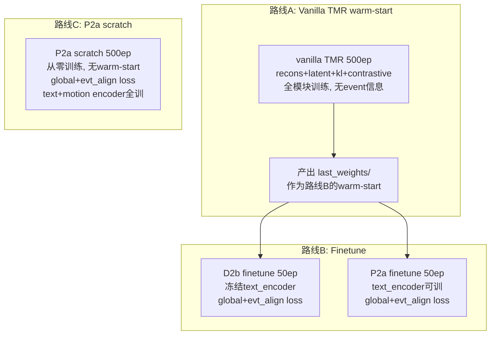

# HumanML3D-E-MP 多 Motion Rep 实验方案

## 实验总览

三条路线，每种 motion rep 都跑：




## 路线详情

### 路线 A: vanilla TMR 500ep（产出 warm-start）

- 模型配置: `configs/model/tmr.yaml`（已有，无需修改）
- loss: `recons=1.0, latent=1e-5, kl=1e-5, contrastive=0.1`
- 全模块训练（motion_encoder + text_encoder + motion_decoder）
- 数据: `data=humanml3d_e_mp`，event 字段被忽略（vanilla TMR 的 `compute_loss` 不读 event 字段，collate 产出的 event 字段不影响）
- 产出: 每种 rep 各自的 `last_weights/`，作为路线 B 的 warm-start
- batch_size=128, seed=1234, epochs=500

### 路线 B: Finetune（D2b + P2a 都跑）

- 从路线 A 的 `last_weights/` warm-start
- 新建配置 `tmr_d2b_ft.yaml`: warm-start 指向路线 A 产出，`warm_start_event_head=false`，`freeze_text_encoder=true`
- 新建配置 `tmr_p2a_ft.yaml`: 同上但 `freeze_text_encoder=false`
- epochs=50, batch_size=128
- warm_start_weights_dir 通过 Hydra override 动态指定（因为每种 rep 的路线 A 产出路径不同）

### 路线 C: P2a scratch 500ep（不 finetune 路线）

- 已有配置 `configs/model/tmr_p2a_scratch.yaml`（无需修改）
- 从零训练，无 warm-start
- loss: `global=0.1, evt_align=1.0`
- text_encoder + motion_encoder + event_head 全训，motion_decoder 冻结
- epochs=500, batch_size=128

为什么"不 finetune"路线选 P2a 而不是 D2b：D2b 的 `compute_loss`（继承自 `tmr_d2a.py:117`）中 text_encoder 硬编码在 `torch.no_grad()` 内，从零训练时随机初始化的 text_encoder 无法收到梯度，contrastive loss 无意义。P2a 通过 `_grad_context` 动态控制，`freeze_text_encoder=false` 时 text_encoder 有梯度，是从零训练的唯一可行选择。

## 需要创建/修改的文件

### 新建配置文件（3 个）

1. `configs/model/tmr_d2b_ft.yaml` — D2b finetune 配置
  - `_target_: src.model.tmr_d2b.TMRD2bFullMotionEncoder`
  - `warm_start_weights_dir: null`（运行时通过 Hydra override 指定）
  - `warm_start_event_head: false`
  - `freeze_text_encoder: true, freeze_motion_backbone: false, freeze_motion_decoder: true`
2. `configs/model/tmr_p2a_ft.yaml` — P2a finetune 配置
  - `_target_: src.model.tmr_p2a.TMRP2aFullMotionTextEncoder`
  - `warm_start_weights_dir: null`（运行时通过 Hydra override 指定）
  - `warm_start_event_head: false`
  - `freeze_text_encoder: false, freeze_motion_backbone: false, freeze_motion_decoder: true`
3. `configs/model/tmr_p2a_scratch.yaml` — 已存在，无需修改

### 修改 Python 入口（1 个）

`scripts/run_tmr_humanml3de_mp_motion_repr.py`:

- 新增 `--stage` 参数（`warmstart` / `finetune_d2b` / `finetune_p2a` / `scratch`）
- `warmstart` 阶段: model=tmr, epochs=500
- `finetune_d2b` 阶段: model=tmr_d2b_ft, epochs=50, 自动注入 `warm_start_weights_dir` 指向路线 A 产出
- `finetune_p2a` 阶段: model=tmr_p2a_ft, epochs=50, 同上
- `scratch` 阶段: model=tmr_p2a_scratch, epochs=500
- `--stage all` 按顺序跑 warmstart -> finetune_d2b + finetune_p2a（串行）

### 修改 Shell 脚本（2 个）

`scripts/run_tmr_humanml3de_mp_gpu0.sh` 和 `gpu1.sh`:

- 新增 `STAGE` 环境变量（默认 `all`）
- 传递 `--stage` 给 Python 入口
- gpu0: schemas=(guo263 pos66 kimodo261)
- gpu1: schemas=(smpl135 hy201 hml272)

## 闭环测试流程

guo263 闭环测试（先跑这个，确认指标正常后再跑 6 种 rep）:

```bash
# 只跑 guo263，全部 4 条路线
bash scripts/run_tmr_humanml3de_mp_gpu0.sh \
  --schemas guo263 \
  --skip-retrieval
```

验收标准：路线 A（vanilla TMR）前 10 epoch 的 v_t2m/R01 应从 ~1% 涨到 ~10%，与 `outputs/tmr_humanml3d_guoh3dfeats/train.out` 的 epoch 0-10 趋势一致。

## 产出目录结构

```
outputs/humanml3d_e_mp_motion_repr_server/
  tmr/guo263/                    # 路线A: vanilla TMR warm-start
  tmr/pos66/
  ...
  tmr_d2b_ft/guo263/             # 路线B: D2b finetune
  tmr_p2a_ft/guo263/             # 路线B: P2a finetune
  tmr_p2a_scratch/guo263/        # 路线C: P2a scratch
```

